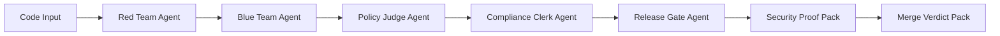

# Agent Control Tower IQ / SecureGuard-LM IQ

## One-line Pitch

Agent Control Tower IQ is a safety operating system for AI agents, with SecureGuard-LM IQ code security review as a secondary capability.

## Problem

AI-assisted coding accelerates development, but insecure code can also reach production faster. Teams need security review that is explainable, policy-grounded, and safe for human approval.

## Solution

Agent Control Tower IQ governs context, tools, memory, diffs, final output, and multi-agent handoffs across the agent lifecycle.

## Agent Safety Studio

Agent Control Tower IQ includes five modes:

1. **Agent Preflight** — creates a safe mission plan before the agent runs.
2. **Repo Guardian** — generates repo-level safety files like `.agent-safety.yml`.
3. **Agent Diff Guard** — checks agent-generated diffs for scope creep and risky side effects.
4. **Output Firewall** — scans final agent output before publishing or submitting.
5. **Safe Handoff Builder** — controls what one agent can safely pass to another agent.

**Make sure AI agents see only what they should, do only what they are allowed to do, and submit only safe output.**

All studio simulations are local and synthetic. They do not execute user code, agent tools, shell
commands, deployments, or external API calls.

## What Makes It Unique

SecureGuard-LM IQ does not stop at vulnerability detection. It creates:

- Security Findings
- Policy Evidence
- Safe Attack Replay
- Fix Diff
- Traceability Matrix
- Secure Merge Passport
- GitHub-style PR Review Comment
- CI/CD Security Gate Result
- SARIF-style Export Preview
- Compliance Mapping

**From vulnerability detection to policy-grounded merge verdict.**

## Unique Concept: Security Courtroom

SecureGuard-LM IQ turns secure code review into a multi-agent courtroom workflow. Risky code is
placed on trial before merge: agents present the risk argument, remediation argument, policy
evidence, compliance impact, and final release-gate decision.

This makes the reasoning chain easy to review and distinguishes SecureGuard-LM IQ from scanners
that stop after producing alerts.

## Multi-Agent Roles

- **Red Team Agent:** Presents a safe simulated risk argument showing how a finding could be abused.
- **Blue Team Agent:** Presents the fix argument and explains how remediation reduces risk.
- **Policy Judge Agent:** Grounds the decision in Foundry IQ-compatible secure coding policy evidence.
- **Compliance Clerk Agent:** Maps findings to OWASP, CWE, NIST SSDF, SOC 2 / Secure SDLC, and ISO 27001.
- **Release Gate Agent:** Produces the final merge verdict: Approve with caution, Review required, or Block until fixed.

## Market-Language Optimized Security Review

SecureGuard-LM IQ does not claim to support every programming language perfectly. Instead, it
focuses on the languages most common in modern application and enterprise development.

Primary coverage:

- JavaScript / TypeScript
- Python
- Java
- C#
- Go

Secondary coverage:

- PHP
- C / C++
- Rust

The JavaScript/Node.js demo includes the richest scan-to-fix workflow. Other market languages
support vulnerability detection, policy evidence, Security Courtroom reasoning, remediation
guidance, and Merge Verdict Pack artifacts.

**Market-language optimized through modular security rule packs.**

## Microsoft IQ Integration

### Mock Mode

- Default and fully demoable locally
- Uses `MockFoundryIQProvider` and synthetic secure coding policy documents
- Requires no Azure credentials
- Clearly identified as mock retrieval in the UI and scan response

### Optional Real Mode

- Uses `FoundryIQProvider`
- Calls an Azure AI Search / Microsoft Foundry IQ knowledge base retrieve endpoint
- Requires a server-side Azure Search endpoint, API key, and knowledge base name
- Safely falls back to mock mode when configuration is incomplete
- Never exposes the Azure Search API key to browser code

See [`docs/real-foundry-iq-setup.md`](docs/real-foundry-iq-setup.md).

## Merge Verdict Pack

The Merge Verdict Pack turns the courtroom workflow into merge-ready artifacts:

- Final merge verdict and reason
- Risk score before and after
- Blocking issues and human-review decision
- Policy evidence and compliance mapping
- Security Proof Pack and Secure Merge Passport
- GitHub-style PR Review Comment
- CI/CD Security Gate Result
- SARIF-style Export Preview
- Reviewer checklist

## Merge Verdict Artifact Pack

SecureGuard-LM IQ generates professional security artifacts that can be used in developer
workflows:

- GitHub-style PR review comment
- SARIF-style preview
- CI/CD gate summary
- Reviewer checklist
- Compliance evidence summary
- Security Courtroom summary

**SecureGuard-LM IQ turns security findings into merge-ready decision artifacts.**

The dashboard can copy each text artifact and download the SARIF-style preview as
`secureguard-results.sarif.json`. The SARIF output is a demo preview; future integrations can
upload it to GitHub Advanced Security or Azure DevOps pipelines.

## CI/CD and DevSecOps Integration

- Run the local CLI with `npm run secureguard -- scan <file>`
- Export JSON with `--json`
- Export SARIF-style JSON with `--sarif`
- Start from the demo [GitHub Actions template](docs/github-action-example.yml)
- Start from the demo [Azure DevOps pipeline template](docs/azure-devops-pipeline-example.yml)
- Future versions can integrate directly with GitHub Advanced Security and Azure DevOps

The provided workflow files are demo templates and require production hardening, permission review,
and secure artifact handling.

## Architecture



The Next.js App Router UI calls server-side API routes under `app/api`. Scanner, IQ provider, fixer, and report modules remain isolated under `lib`. The default mock provider is deterministic; the optional real provider is isolated behind the same `IQProvider` interface.

## Demo Walkthrough

The `/scan` page presents a four-step judge-friendly flow:

1. **Select and load a market-language demo**
2. **Run Security Courtroom**
3. **Generate Safer Fix**
4. **Create Merge Verdict Pack**
5. **Generate DevSecOps Artifacts**

The JavaScript demo detects five supported vulnerability patterns, retrieves citations, reduces
modeled risk, proves remediation, and creates reviewer-ready artifacts. Additional deterministic
rule packs cover Python, Java, C#, Go, PHP, C/C++, and Rust.

## Safety

- Uses synthetic vulnerable code and synthetic policies by default
- Executes no real attacks
- Does not upload or execute reviewed code
- Do not submit confidential or private source code
- Does not auto-merge generated fixes
- Requires developer review before production use
- Falls back safely when real Microsoft IQ configuration is incomplete

## Browser Companion Extension

SecureGuard-LM IQ includes an optional Manifest V3 browser companion extension for desktop Chromium
browsers. It lets developers select code on GitHub, GitLab, or Azure DevOps pages and send only the
selected text into the local SecureGuard scan workflow.

- Works on desktop Chromium browsers such as Chrome, Edge, and Brave
- Not intended for mobile browsers
- Does not collect credentials
- Does not scrape a whole page when no text is selected
- Does not send data to external services
- Opens the local demo at `http://localhost:3000/scan`

Local installation instructions are in [`docs/browser-extension.md`](docs/browser-extension.md).

## VS Code Extension

The local **Agent Control Tower IQ** VS Code extension runs Agent Watchtower against the currently
open workspace. It publishes findings to the Problems panel and Output channel, updates a status bar
indicator, shows a local report webview, and supports debounced realtime quick scans.

```bash
npm run extension:install
npm run extension:compile
```

Open `vscode-extension` in VS Code and press F5 to launch the Extension Development Host. Setup and
commands are documented in [`docs/IDE_EXTENSION_SETUP.md`](docs/IDE_EXTENSION_SETUP.md).

## For Judges

No Azure keys are needed for the default demo.

```bash
npm install
npm run dev
```

Open [http://localhost:3000/scan](http://localhost:3000/scan), then complete the four demo steps.

Quality checks:

```bash
npm run lint
npm run build
```

CLI examples:

```bash
npm run secureguard -- scan ./data/demo/vulnerable-node-express.js
npm run --silent secureguard -- scan ./data/demo/vulnerable-node-express.js --json
npm run --silent secureguard -- scan ./data/demo/vulnerable-node-express.js --sarif
```

Judge-facing pages:

- `/` — Agent Control Tower IQ overview
- `/control-tower` — primary Agent Preflight and lifecycle control plane
- `/agent-safety` — runnable Agent Preflight, safety artifacts, and digital-twin simulation
- `/repo-guardian` — repo readiness and safety-file generation
- `/diff-guard` — agent-generated diff side-effect analysis
- `/output-firewall` — final-output scan and sanitization
- `/safe-handoff` — multi-agent context and tool boundary builder
- `/scan` — full four-step demo
- `/report` — Merge Verdict Pack preview
- `/submission` — copy-ready submission package

## Environment

```env
NEXT_PUBLIC_IQ_MODE=mock

# Optional real Azure AI Search / Foundry IQ mode
AZURE_SEARCH_ENDPOINT=
AZURE_SEARCH_API_KEY=
AZURE_SEARCH_KNOWLEDGE_BASE_NAME=
AZURE_SEARCH_API_VERSION=2025-11-01-preview
```

See `.env.example` for optional Foundry metadata.

## Future Roadmap

- Deeper Microsoft Foundry IQ and Foundry Agent Service integration
- GitHub PR comments
- Azure DevOps PR checks
- SARIF file download
- Deeper framework-specific rules for each market-language pack
- Enterprise policy packs

## Submission Assets

- [Architecture documentation](docs/architecture.md)
- [Real Foundry IQ setup](docs/real-foundry-iq-setup.md)
- [Browser companion setup](docs/browser-extension.md)
- [Two-minute demo video script](docs/demo-video-script.md)
- [Final submission checklist](docs/final-submission-checklist.md)
- [MIT License](LICENSE)
