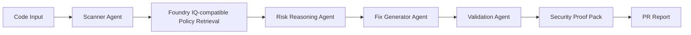
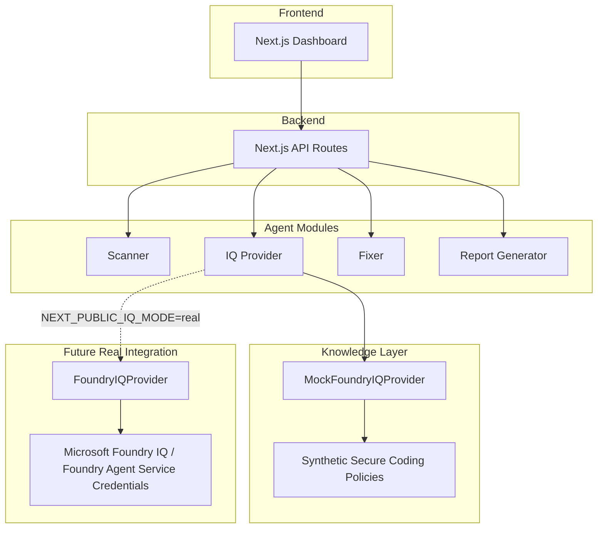

# SecureGuard-LM IQ Architecture

## Agent Workflow

## System Architecture

## Integration Modes

The default MVP mode is a **Foundry IQ-compatible mock provider using synthetic policy documents**. It provides deterministic policy evidence without requiring Azure credentials.

`FoundryIQProvider` is an optional server-side adapter for Azure AI Search / Microsoft Foundry IQ knowledge base retrieval. Real retrieval is used only when `NEXT_PUBLIC_IQ_MODE=real` and the required Azure Search configuration is supplied; otherwise the app safely falls back to mock retrieval.

## Module Responsibilities

- **Next.js Dashboard:** Runs the guided demo and displays findings, evidence, fixes, proof artifacts, and reports.
- **Next.js API Routes:** Coordinate scanning, fixing, policy grounding, and PR report generation.
- **Scanner:** Deterministically detects the five supported MVP vulnerability patterns.
- **IQ Provider:** Selects mock or optional real Azure AI Search / Foundry IQ policy retrieval.
- **Fixer:** Generates the safer demo implementation and remediation explanations.
- **Report Generator:** Creates attack replay, traceability, Secure Merge Passport, and PR-ready Markdown.
- **Synthetic Policy Knowledge Layer:** Supplies safe, local evidence for the hackathon demo.
